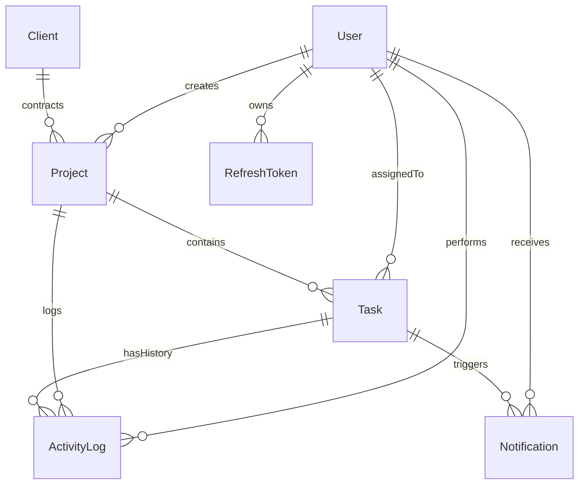

# VeloFlow — Real-Time Client Project Dashboard

[](https://www.typescriptlang.org/)
[](https://react.dev/)
[](https://nodejs.org/)
[](https://www.postgresql.org/)
[](https://www.prisma.io/)
[](https://socket.io/)

VeloFlow is a production-grade, real-time client project dashboard engineered for the **Velozity Global Solutions Senior-Level Full-Stack Technical Assessment**. Designed with strict API-level role-based authorization, resource ownership enforcement, atomic PostgreSQL transactions, real-time WebSocket room security, and an independent background overdue scheduler.

---

## 1. Assessment Submission Explanation (150–250 Words)

The most demanding engineering challenge was enforcing strict, multi-tenant role filtering across both asynchronous WebSockets and historical catch-up feeds without leaking unauthorized data. Standard implementations naively broadcast state changes to all clients and filter on the frontend. In VeloFlow, security is enforced entirely on the server: task mutations execute within atomic PostgreSQL `$transactions` where task status, historical `ActivityLog`, and PM `Notifications` commit simultaneously. 

For the real-time feed, Socket.IO rooms are guarded server-side: Admin joins `global:admin`, Project Managers join `project:{id}` only for projects they created, and Developers receive events through dedicated `user:{id}` channels strictly for their assigned tasks. When an offline user reconnects, missed events are queried directly from PostgreSQL using role-tailored SQL `WHERE` clauses (returning the last 20 events), completely eliminating reliance on ephemeral in-memory caches.

Given more time, I would decouple the WebSocket gateway into a dedicated distributed service backed by Redis Pub/Sub to allow horizontal scaling across multi-region clusters, while introducing optimistic UI rollbacks with conflict resolution for concurrent task drag-and-drop operations.

*(Word count: 184 words)*

---

## 2. System Architecture

```
React 18 + TypeScript (Vite)
       │
       ├── TanStack Query v5 (Server state caching & real-time invalidation)
       ├── Zustand (Client-side UI state)
       ├── Axios (Centralized API client with automatic token refresh)
       └── Socket.IO Client (JWT-authenticated bi-directional events)
       │
       ▼ (HTTP + WebSocket)
Express API + Socket.IO Server (Node.js + TS)
       │
       ├── Security Middleware (Helmet, CORS, CookieParser)
       ├── API Authorization & Ownership Middleware (RBAC + DB Scoping)
       ├── Business Logic Service Layer
       ├── node-cron Overdue Scheduler (Runs independently every 15 mins)
       └── Prisma ORM ($transaction atomic guarantees)
       │
       ▼
PostgreSQL 16 Engine (Normalized relational tables, composite indexing)
```

---

## 3. Key Features

- **Strict API-Level RBAC & Ownership Verification**:
  - `ADMIN`: Global oversight of users, clients, projects, tasks, and activity.
  - `PROJECT_MANAGER`: Manages exclusively the projects they created; cannot view or modify other PMs' projects or tasks.
  - `DEVELOPER`: Strictly restricted to viewing and updating status for tasks assigned to them; cannot view other developers' task queues or access PM management endpoints.
- **Enterprise JWT Authentication & Rotation**:
  - Short-lived Access Token (15m) held strictly in memory.
  - Long-lived Refresh Token (7d) stored in an `HttpOnly`, `SameSite=Strict`, `Path=/api/auth` secure cookie.
  - Refresh token rotation on every call with token reuse detection (revoking all sessions if a replay attack is detected).
- **Atomic Database Transactions**:
  - Every task status transition updates the task, records structured history in `ActivityLog`, and generates a `Notification` in a single `prisma.$transaction`.
  - WebSocket events are dispatched **only after** transaction commit.
- **Real-Time WebSocket Architecture**:
  - Sockets authenticate via JWT during handshake.
  - Server validates room membership for `project:{id}` and `global:admin`.
  - Presence tracking deduplicates multi-tab connections using `Map<userId, Set<socketId>>`.
- **Missed Events Recovery**:
  - Reconnecting clients query `GET /api/activity/recent` to pull the latest 20 events from PostgreSQL filtered by role.
- **Independent Background Overdue Scheduler**:
  - `node-cron` runs independently every 15 minutes scanning for past-due incomplete tasks and idempotently flagging `isOverdue = true`.

---

## 4. Database Schema & Indexing Rationale



### High-Performance Indexing Strategy
- `Task(assignedDeveloperId, status)`: Composite index optimizing developer dashboard queries.
- `Task(projectId, status)`: Composite index powering project Kanban and board columns.
- `Task(isOverdue)` & `Task(dueDate)`: Accelerates the 15-minute background overdue scheduler scan.
- `Project(createdById, createdAt)`: Powers PM dashboard project listings ordered by date.
- `ActivityLog(projectId, createdAt)`: Enables rapid project timeline retrieval without full table scans.
- `Notification(recipientId, isRead)`: Optimizes unread badge count queries.
- `RefreshToken(tokenHash)`: Constant-time hash verification on token refresh.

---

## 5. Architectural Decisions & Rationale

### 5.1 Real-Time WebSocket Architecture (Socket.IO vs. Native WebSockets)
**Decision**: Selected **Socket.IO 4.7** over native `ws`.
- **Room Multiplexing**: Built-in room semantics (`socket.join('project:id')`, `user:id`, `global:admin`) provide isolated subscription channels with O(1) targeting, avoiding custom protocol framing and manual connection routing.
- **Connection Resilience**: Built-in heartbeats, automatic reconnection with exponential backoff, and disconnection detection prevent ghost presence states.
- **Transport Flexibility**: Transports prioritize pure `websocket`, while retaining HTTP long-polling fallback for strict enterprise corporate firewall environments.
- **Handshake Authentication**: Seamless middleware layer (`io.use(socketAuthMiddleware)`) verifies JWT tokens before allowing the handshake to complete, ensuring zero unauthorized socket connections exist on the server.

### 5.2 Background Overdue Scheduler (node-cron vs. BullMQ / Redis)
**Decision**: Selected **node-cron** over BullMQ + Redis.
- **Zero External Infrastructure Overhead**: Operates entirely within the Node.js process without mandating a separate Redis cluster for periodic database sweeps.
- **Authoritative Single Source of Truth**: Evaluates overdue criteria directly against PostgreSQL timestamps rather than duplicating schedule states in a key-value store.
- **Guaranteed Idempotency**: The query `WHERE status != 'DONE' AND dueDate < now AND isOverdue = false` guarantees that running the job repeatedly causes zero redundant writes or duplicate triggers.

### 5.3 Token Storage & Enterprise Session Security
**Decision**: Strict separation of Access Token (In-Memory) and Refresh Token (`HttpOnly` Cookie).
- **XSS Defense**: Storing tokens in `localStorage` was strictly rejected because any malicious XSS payload could extract credentials. Instead, the refresh token is stored exclusively in a hardened cookie with `HttpOnly`, `SameSite=Strict`, and `Path=/api/auth`.
- **CSRF Mitigation**: Access tokens are held strictly in client-side memory (Zustand) and attached via `Authorization: Bearer <token>` headers on each request, neutralizing cross-site request forgery.
- **Cryptographic Rotation & Replay Detection**: Every call to `POST /api/auth/refresh` revokes the old refresh token and issues a new one. All refresh tokens are stored as SHA-256 hashes in PostgreSQL; if an already-revoked token hash is submitted, the system detects a token reuse replay attack and revokes all active sessions for that user immediately.

---

## 6. Known Limitations & Production Scaling Blueprint

1. **Horizontal WebSocket Scaling**:
   - *Current State*: Room subscriptions and presence maps operate in-memory on a single Node.js instance.
   - *Scaling Path*: In a multi-node load-balanced cluster, attach the `@socket.io/redis-adapter` (or Redis Streams) to broadcast room events seamlessly across server instances.
2. **Distributed Job Execution**:
   - *Current State*: `node-cron` runs locally on the application server.
   - *Scaling Path*: In multi-pod container deployments, wrap the overdue scan with PostgreSQL advisory locks (`pg_try_advisory_xact_lock`) or migrate the scheduler to BullMQ with a shared Redis lock to prevent redundant concurrent sweeps across pods.
3. **Optimistic Concurrency Control**:
   - *Current State*: Task updates use atomic `$transaction` writes where the latest commit wins.
   - *Scaling Path*: Introduce an integer `version` field on `Task` models (`@version`) to detect concurrent status modifications by multiple users and prompt an interactive merge resolution dialog.

---

## 7. Seed Credentials (Development Only)

All seeded test accounts use the password: `Password123!`

| Role | Email | Purpose |
|---|---|---|
| **Admin** | `admin@velozity.dev` | Enterprise KPIs, user & client administration, global activity audit |
| **Project Manager 1** | `pm1@velozity.dev` | Owns Project 1 & 2 (Trading Engine & Telemetry Portal) |
| **Project Manager 2** | `pm2@velozity.dev` | Owns Project 3 (Maritime Fleet AI) |
| **Developer 1** | `dev1@velozity.dev` | Assigned to critical trading engine and telemetry tasks |
| **Developer 2** | `dev2@velozity.dev` | Assigned to ledger settlement and fleet waypoint solver |
| **Developer 3** | `dev3@velozity.dev` | Assigned to ECG visualizer and customs webhooks |
| **Developer 4** | `dev4@velozity.dev` | Assigned to audit trails and AIS ingestion |

---

## 8. Local Quickstart

### Prerequisites
- Node.js 20+
- PostgreSQL 16 (or Docker)

### Option A: Docker Compose (Fastest)
```bash
# 1. Start PostgreSQL container
docker compose up -d postgres

# 2. Install dependencies
npm install

# 3. Apply migrations & seed database
cd backend
npx prisma migrate dev --name init
npx prisma db seed
cd ..

# 4. Start backend & frontend concurrently
npm run dev
```

### Option B: Local PostgreSQL
```bash
# 1. Configure backend/.env with your DATABASE_URL
cp .env.example backend/.env

# 2. Install dependencies
npm install

# 3. Setup database
cd backend
npx prisma migrate dev --name init
npx prisma db seed
cd ..

# 4. Run development servers
npm run dev
```

Frontend runs on: `http://localhost:5173`  
Backend API runs on: `http://localhost:5000`

---

## 9. Automated Testing

Run the automated test suite covering authentication, RBAC attack vectors, atomic transactions, and WebSocket security:

```bash
cd backend
npm test
```

### Test Coverage Highlights
- `auth.test.ts`: Access token verification, invalid signature rejection, refresh token SHA-256 generation.
- `rbac-attack.test.ts`: Developer attempting PM endpoint (403), PM1 attempting PM2 project (403), Developer attempting another developer's task (403), Admin bypass.
- `task-transaction.test.ts`: Atomic `$transaction` task update, activity log creation, and review notification dispatch.
- `socket-auth.test.ts`: Room join authorization for admin, PM, and developers.

---

