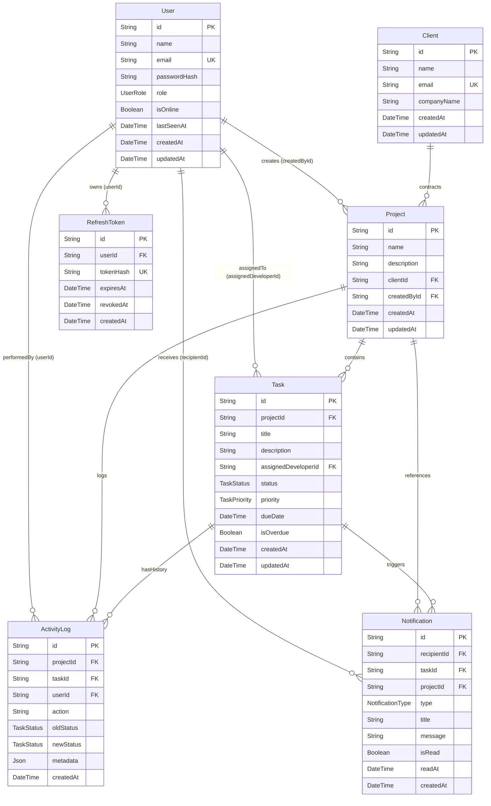

# VeloFlow Database Architecture & Indexing Decisions

## 1. Entity-Relationship (ER) Diagram

## 2. Database Indexing Decisions & Rationale

Indexes were chosen deliberately based on query access patterns rather than applied indiscriminately:

### `User` Table
- `@@index([email])`: Accelerates authentication lookup during `POST /api/auth/login`.
- `@@index([role])`: Optimizes role-based queries (e.g. listing all developers when a PM assigns a task).

### `Project` Table
- `@@index([createdById])`: Essential for PM queries (`WHERE createdById = user.id`) to fetch their assigned projects with minimal latency.
- `@@index([clientId])`: Fast joins when rendering projects grouped by client.
- `@@index([createdById, createdAt])`: Composite index optimizing the manager dashboard project feed ordered by creation date.

### `Task` Table
- `@@index([projectId])`: Accelerates retrieval of tasks belonging to a specific project.
- `@@index([assignedDeveloperId])`: Powers the developer dashboard (`WHERE assignedDeveloperId = user.id`).
- `@@index([status])`, `@@index([priority])`, `@@index([dueDate])`: Accelerates user filters in the task board.
- `@@index([isOverdue])`: Dramatically speeds up the background `node-cron` overdue scanner (`WHERE status != 'DONE' AND dueDate < now AND isOverdue = false`).
- `@@index([assignedDeveloperId, status])`: High-frequency composite index for the developer board filtering by status.
- `@@index([projectId, status])`: High-frequency composite index for project board columns (TODO, IN_PROGRESS, IN_REVIEW, DONE).

### `ActivityLog` Table
- `@@index([projectId])`, `@@index([taskId])`, `@@index([userId])`: Quick traversal of foreign relationships.
- `@@index([createdAt])`: Accelerates global chronological activity sorting.
- `@@index([projectId, createdAt])`: Composite index for fetching project-specific activity timelines without full-table scans.

### `Notification` Table
- `@@index([recipientId])`: Isolates notifications to the recipient.
- `@@index([isRead])`: Speeds up unread badge calculation.
- `@@index([recipientId, isRead])`: High-frequency composite index for `count({ where: { recipientId, isRead: false } })` and header dropdown renders.

### `RefreshToken` Table
- `@@index([tokenHash])`: Unique hash lookup during token rotation on `POST /api/auth/refresh`.
- `@@index([userId])`: Enables instant invalidation of all sessions if replay is detected.
- `@@index([expiresAt])`: Efficient pruning of expired sessions.
